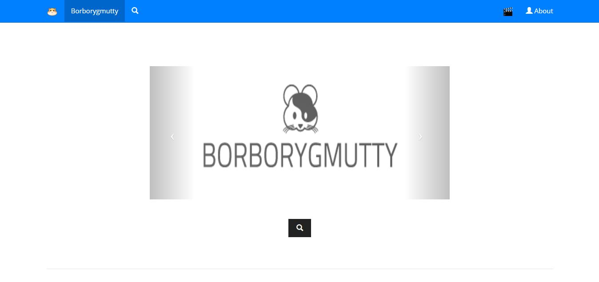
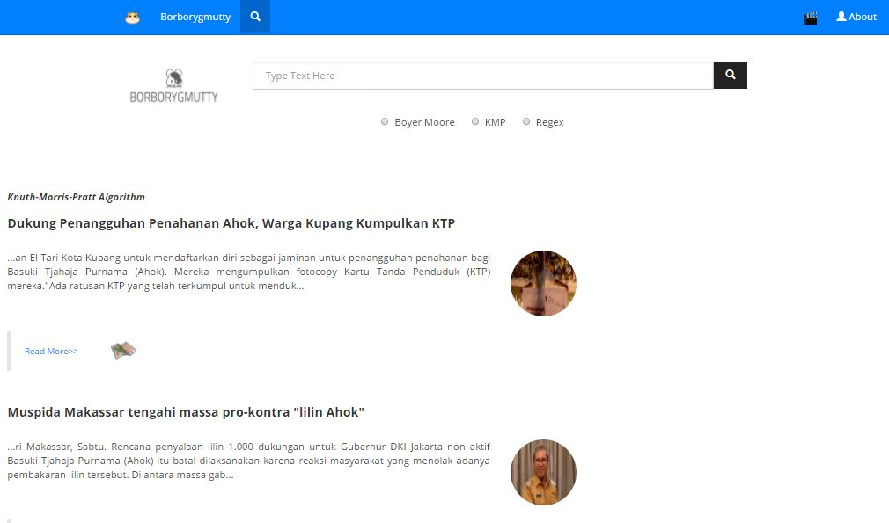

# Borborygmutty
### Tugas Besar 3 IF2211 Strategi Algoritma 

### Deskripsi
News Aggregator yang dapat menampilkan berita-berita terbaru dari RSS detik, tempo, viva, dan antara news.

Aplikasi ini menggunakan algoritma KMP, Boyer Moore, dan Regex untuk melakukan pencarian berita dari keyword yang dimasukkan. 

### Run
```src/WebApplication2/index.html```

### Contributors:
13515057 - Erick Wijaya

13515063 - Kezia Suhendra

13515111 - Catherine Almira

### Screenshot
##### Menu Utama



##### Halaman Pencarian


